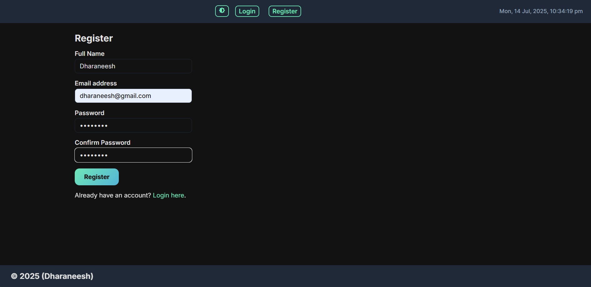
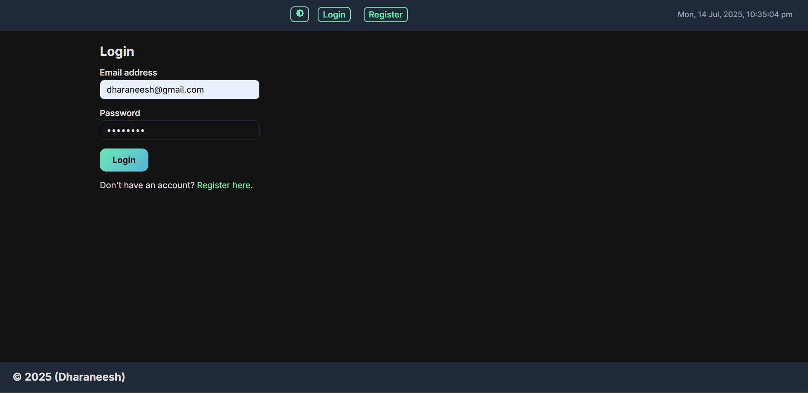
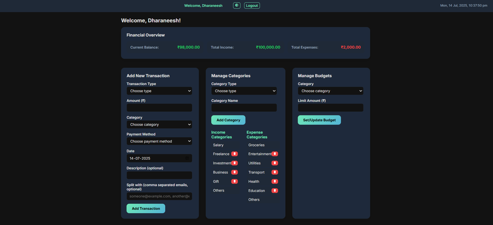
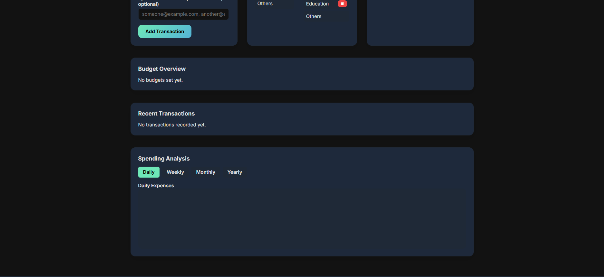

# TrackMySpend – Personal Expense Tracker

TrackMySpend is a full-stack personal expense tracking web application designed to help users manage daily expenses, monitor spending habits, and gain better financial awareness through a clean and interactive interface.

The project focuses on expense recording, budget monitoring, and simple financial analysis using Python-based backend logic and a responsive frontend.

---

# Features

* Add and manage daily expenses
* Categorize expenses efficiently
* Real-time expense tracking
* Budget monitoring and alerts
* Responsive user interface
* JSON-based data storage
* Expense analysis and insights
* Simple and user-friendly dashboard

---

# Tech Stack

## Frontend

* HTML
* CSS
* JavaScript

## Backend

* Python
* Flask

## Database / Storage

* JSON

## Tools

* Git
* GitHub
* VS Code

---

# Project Structure

```bash
Track-my-spend/
│
├── static/                # CSS, JS, Images
├── templates/             # HTML templates
├── data/                  # JSON storage files
├── app.py                 # Main Flask application
├── requirements.txt
├── README.md
└── assets/
```

---

# Installation & Setup

## 1. Clone the Repository

```bash
git clone https://github.com/your-username/TrackMySpend.git
cd TrackMySpend
```

---

## 2. Create Virtual Environment (Optional)

```bash
python -m venv venv
```

Activate virtual environment:

### Windows

```bash
venv\Scripts\activate
```

### Mac/Linux

```bash
source venv/bin/activate
```

---

## 3. Install Dependencies

```bash
pip install -r requirements.txt
```

---

## 4. Run the Application

```bash
python app.py
```

---

## 5. Open in Browser

```bash
http://127.0.0.1:5000
```

---

# How It Works

1. User adds daily expenses.
2. Expense data is stored using JSON.
3. Backend processes and manages records.
4. Dashboard displays expense summaries.
5. Users can monitor spending patterns and budgets.

---

# Screenshots


## Registration Page


## Login Page


## Expense Dashboard
 



```

---

# Future Improvements

* User authentication system
* Database integration (MySQL/PostgreSQL)
* AI-driven financial insights
* Expense prediction system
* Charts and analytics dashboard
* Export reports as PDF/Excel
* Mobile responsive improvements

---

# Learning Outcomes

This project helped in understanding:

* Full-stack web application development
* Flask backend integration
* JSON data handling
* CRUD operations
* Frontend and backend communication
* Expense analysis logic
* Git and GitHub workflow

---

# Author

## Dharaneesh

* Full Stack Developer
* Python Enthusiast


---

# License

This project is developed for educational and learning purposes.

---
